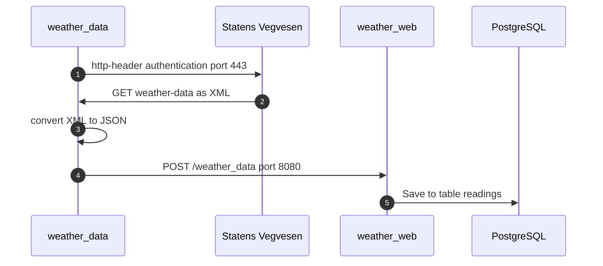

# weather_data
Get weather data from Statens Vegvesen

Parse XML-data and create a JSON-array and push that to a URL.

```mermaid
sequenceDiagram
autonumber
weather_data->>Statens Vegvesen: http-header authentication port 443
Statens Vegvesen->>weather_data: GET weather-data as XML
weather_data->>weather_data: convert XML to JSON
weather_data->>weather_web: POST /weather_data port 8080
weather_web->>PostgreSQL: Save to table readings
```